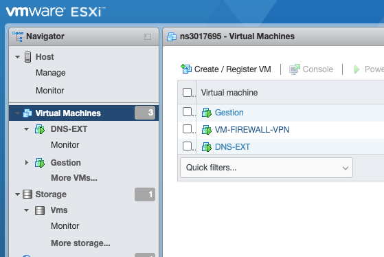
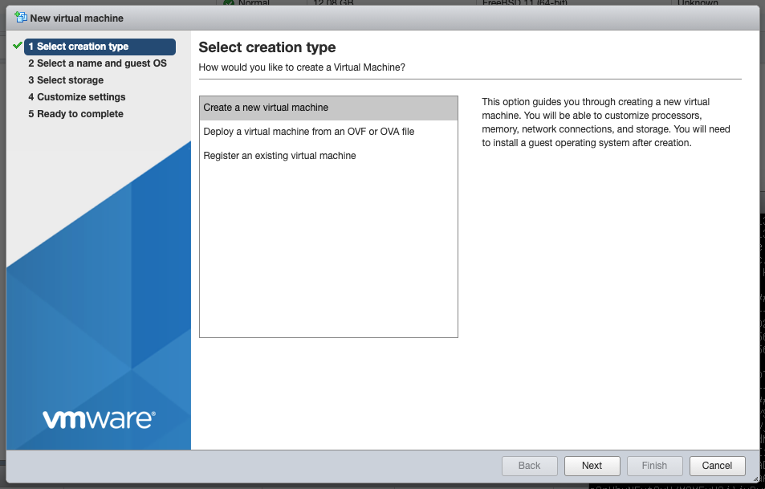
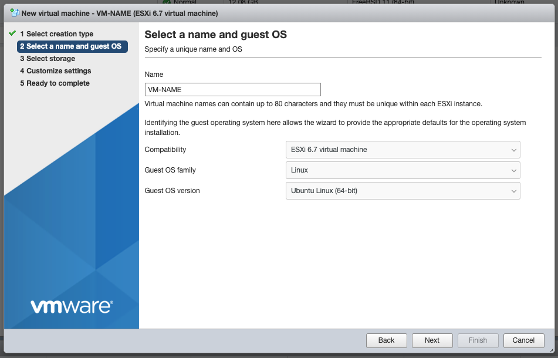
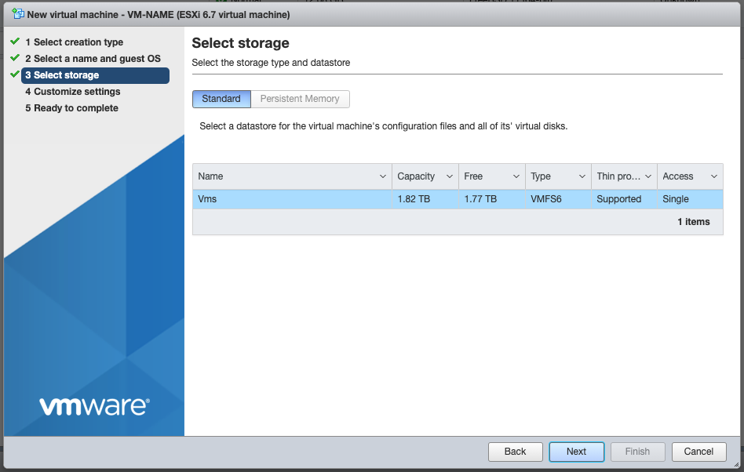
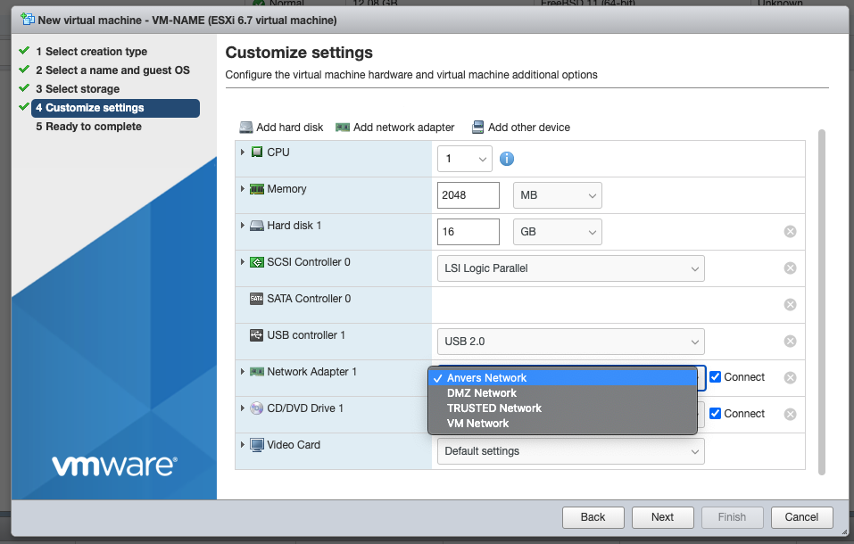
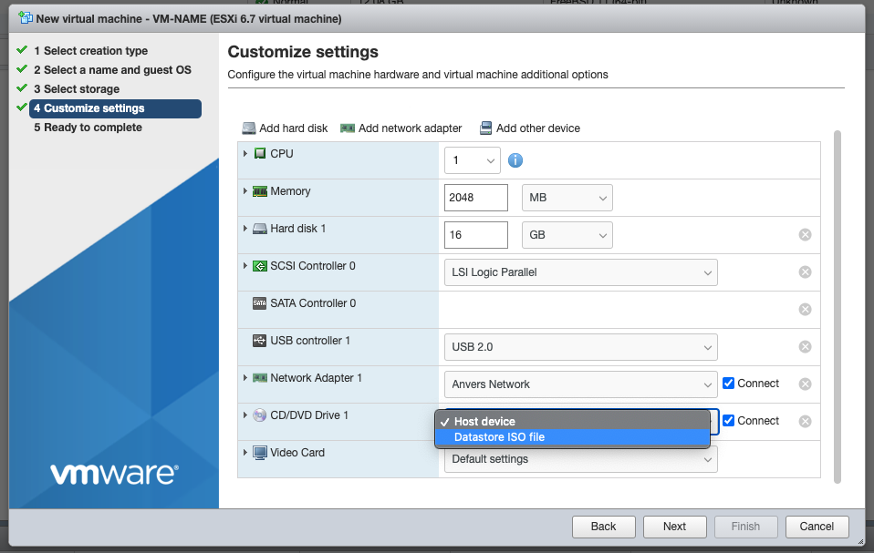
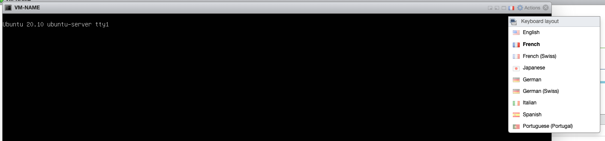

# Manuel d'installation d'une nouvelle VM ubuntu-server. 

1. Connectez-vous au VSphere du site (Bruxelles ou Anvers) sur lequel vous voulez ajouter une VM.
    - Bruxelles: https://37.187.29.4/ui/
    - Anvers: https://149.202.82.25/ui/ 
    > credetials voir fichier `VMWARE.docx`dans les fichiers du groupe B sur Teams.

2. Dans la barre des menus de gauche, cliquez sur `Virtual Machines` > `Create / Register VM`


3. Créez une nouvelle machine virtuelle:
    

4. Donnez lui un nom et définissez le type d'images qui sera utilisé.
    

5. Choisissez le storage par défaut:
    

5. Configurez la VM selon vos désires, et ajoute la au bon réseau.
    

6. Choisissez l'image d'ubuntu server (ubuntu-20.10-live-server) depuis le datastore d'iso! 
    

7. Terminez la création de la VM.
8. Ouvrez la cmd-line de la VM et vérifiez que votre clavier est bien en français (en haut a gauche) 
    

9. Laissez la machine booter
10. Suivez les instructions d'installation avec les configs suivantes :
**language:** `English` 
**keyboard layout:** `Belgian`, **variant:** `Belgian`
**network:** activez `IPV4` en dhcp ou statique
  *config statique:* 
  ```bash
  sous-réseau: 172.1x.xx.0/24
  ipv4: 172.1x.xx.x
  gateway: 172.1x.xx.254
  name-server: 172.1x.12.2,213.186.33.99,8.8.8.8,1.1.1.1
  ```
**proxy:** /
**mirror:** /
Attendez qu'il update
**Storage:** / -> Done -> Continue
**Profile :**
  ```bash
  name: gestion
  server name: XXXXX
  username: gestion
  pwd: ...
  ```
  
**SSH :** activer
Terminez l'installation et rebooter


11. Une fois sur la machine exécutez les commandes suivantes:
  ```bash
  sudo apt-get update -y && sudo apt-get upgrade -y
  sudo groupadd docker && sudo usermod -aG docker gestion
  sudo reboot now
  ```